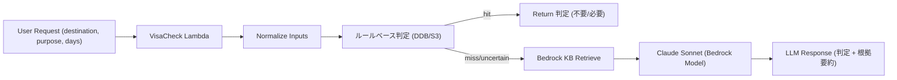

# test

### image

s3-tripy-tool-visacheck-visa-kb-20251004/
  gov/
    usa_visa.html
    uk_visa.pdf
  faq/
    visa_faq.txt
外務省、大使館の公開資料をダウンロード → S3に配置

PDF/HTML/TXT どれでもOK（KBが自動で分割＆ベクトル化）

###テスト
curl -s -X POST "https://<orchestrator-api>/agent" \
  -H "Content-Type: application/json" \
  -d '{"message":"来月アメリカに観光で2週間行くけど、ビザいる？"}'
